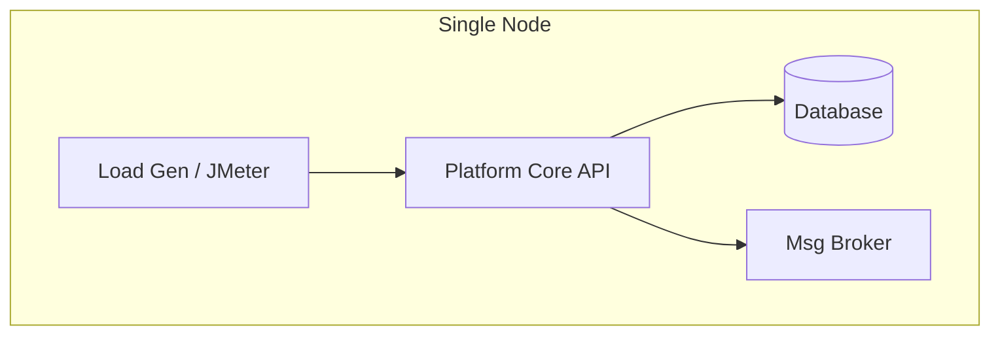
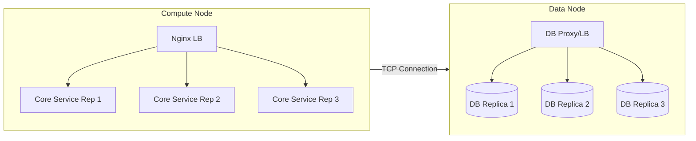

# IoT Platform Benchmarking & Scalability Analysis

Welcome to the master documentation for the IoT Platform Performance Evaluation project. This repository contains the complete infrastructure code, deployment scripts, and workload generators required to benchmark and analyze the scalability of major open-source IoT platforms: **EdgeX Foundry**, **FIWARE**, and **ThingsBoard**.

## 🎯 Project Objective

The primary goal of this project is to evaluate how different IoT platforms perform under varying load conditions and architectural configurations. We simulate real-world IoT scenarios to measure:
- **Throughput**: Messages processed per second.
- **Latency**: End-to-end processing time.
- **Resource Usage**: CPU, Memory, and Network consumption.
- **Scalability**: How well the platform handles horizontal scaling of core components and databases.

---

## 🏗️ Architecture Designs

We utilize two distinct architectural patterns for our tests: **Single Operation** (Monolithic) and **Multiple Operation** (Distributed/Clustered).

### 1. Single Operation (Monolithic)
All core modules, message brokers, and databases run as a single instance on one node. This represents a basic or "edge" deployment.



### 2. Multiple Operation (Clustered / High-Availability)
This architecture splits the deployment across two nodes to test horizontal scalability and fault tolerance.
*   **Node 1 (Compute Plane)**: Runs 3 replicas of the platform's core services, fronted by an Nginx Load Balancer.
*   **Node 2 (Data Plane)**: Runs a 3-node replicated database cluster, fronted by a database-specific load balancer (HAProxy, Pgpool, or Redis Master).



---

## 🚀 Supported Platforms & Modules

| Platform | Core Services Scaled | Database | DB Middleware |
|----------|----------------------|----------|---------------|
| **EdgeX Foundry** | `core-data`, `core-metadata` | Redis | Master-Slave Rep |
| **FIWARE** | `Orion Context Broker`, `IoT Agent` | MongoDB | HAProxy |
| **ThingsBoard** | `TB-Node` (Monolith) | PostgreSQL | Pgpool-II |

---

## 📂 Repository Structure

*   **`master-docs/`**: This documentation hub.
*   **`[platform]-single/`**: Deployment files for Single Operation architecture.
*   **`[platform]-multiple/`**: Deployment files for Multiple Operation architecture.
    *   `server/`: Application services and Nginx LB (Node 1).
    *   `db/`: Database cluster and DB LB (Node 2).
*   **`jmeter-workload/`**: JMeter test plans (`.jmx`) for simulating device traffic.
*   **`grafana-setup/`**: Grafana dashboards for visualizing metrics.
*   **`prometheus-setup/`**: Prometheus configuration for scraping metrics from nodes.

---

## 🛠️ Deployment Guide (Multiple Architecture)

This guide assumes you are deploying the **Multiple Operation** architecture. For Single Operation, simply navigate to the `*-single` directory and run `docker compose up -d`.

### Prerequisites
*   Two Linux machines (VMs or bare metal) reachable by each other.
*   Docker & Docker Compose installed on both.
*   **Important**: Ensure Node 1 can reach Node 2. The default configs assume Node 2 IP is `192.168.2.105`. *You must update `.env` files or `docker-compose.yml` if your IP differs.*

### Step 1: Deploy Database Layer (Node 2)
Always start the database first so the application services have a target to connect to.

1.  Navigate to the platform's DB directory:
    ```bash
    cd [platform]-multiple/db
    ```
2.  Start the cluster:
    ```bash
    docker compose up -d
    ```
3.  Verify the DB Proxy (HAProxy/Pgpool) is listening on the expected port (e.g., `27019` for Mongo, `5432` for Postgres).

### Step 2: Deploy Application Layer (Node 1)

1.  Navigate to the platform's server directory:
    ```bash
    cd [platform]-multiple/server
    ```
2.  **Edit Configuration**: Open `docker-compose.yml` or `.env` and replace `192.168.2.105` with the actual IP address of your **Node 2**.
3.  Start the core services:
    ```bash
    docker compose up -d
    ```
4.  (Optional) Check Health:
    ```bash
    ../check_health.sh
    ```

### Step 3: Deploy Load Balancer (Node 1)

Most `server` directories contain a nested `nginx` setup or include it in the main compose file.

1.  If there is a separate `nginx` folder (e.g., FIWARE, ThingsBoard):
    ```bash
    cd nginx
    docker compose up -d
    ```
2.  This will expose the unified API ports (e.g., `1026` for Orion, `8081` for ThingsBoard) that round-robin requests to the 3 backend replicas.

---

## 📊 Monitoring & Testing

### 1. Setup Observability
Deploy Prometheus and Grafana to visualize the performance.
*   **Prometheus**: Deploy `prometheus-setup/` on a monitoring node. Configure `prometheus.yml` to scrape targets from Node 1 and Node 2.
*   **Grafana**: Deploy `grafana-setup/`. Import the dashboards located in `grafana-setup/grafana/provisioning/dashboards/`.

### 2. Run Workloads
We use Apache JMeter to generate load.
1.  Install JMeter on a client machine (separate from Node 1/Node 2 to avoid resource contention).
2.  Open the relevant test plan from `jmeter-workload/platforms/[platform]/`.
3.  Configure the **Target Host** in JMeter to point to **Node 1's Nginx IP**.
4.  Run the test and monitor the Grafana dashboards.

---

## 📝 License
This project is open-source. See individual directories for specific component licenses.