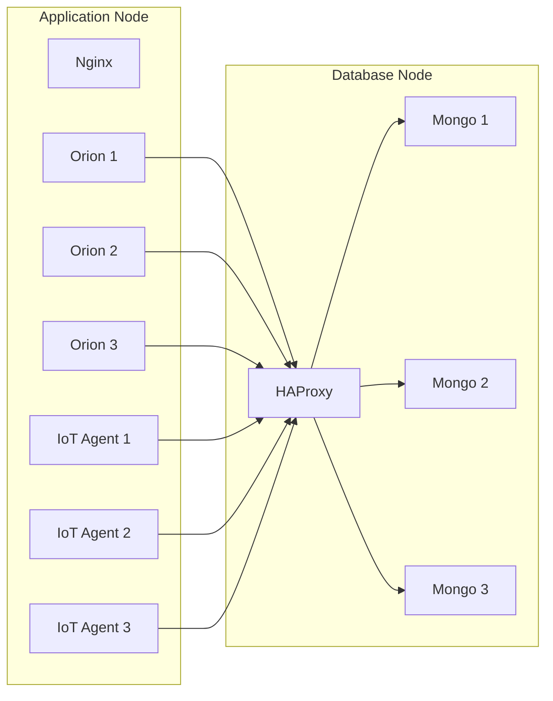

# FIWARE - Multiple Operation (Distributed)

This branch contains the deployment configuration for a distributed FIWARE architecture, designed for scalability testing. The deployment is split into two nodes:
*   **Node 1 (Server)**: Runs the Compute/Application plane (Orion Context Broker replicas, IoT Agents, Message Brokers).
*   **Node 2 (DB)**: Runs the Data plane (MongoDB Replica Set, HAProxy).

## 🏗️ Architecture



## 🚀 Deployment Guide

### Step 1: Database Layer (Node 2)

Deploy the database cluster first so the application services can connect.

1.  Navigate to the `db` folder:
    ```bash
    cd db
    ```
2.  Start the MongoDB Replica Set and HAProxy:
    ```bash
    docker compose up -d
    ```
    *   This creates a local network `mongo-net` automatically.
    *   An initiator container (`mongo-initiator`) runs once to configure the replica set.
3.  Verify connection:
    Ensure port `27019` (HAProxy) is accessible from Node 1.

### Step 2: Application Layer (Node 1)

1.  Navigate to the `server` folder:
    ```bash
    cd server
    ```
2.  **Create the External Network**:
    The compose file expects an external network named `fiware-network`.
    ```bash
    docker network create fiware-network
    ```
3.  **Configure Connection**:
    Edit the `.env` file in the `server/` directory to set the IP address of Node 1 (or the load balancer IP if using one for MQTT/AMQP) so the IoT Agents know where to advertise themselves.
    
    Also, open `docker-compose.yml` and ensure the `dbURI` and `IOTA_MONGO_HOST` point to your **Node 2 IP address** (default is `192.168.2.105`).
    
    **`.env` example:**
    ```ini
    NODE1_IP=192.168.2.105
    ```

4.  Start the services:
    ```bash
    docker compose up -d
    ```

### Step 3: Nginx Load Balancer (Node 1)

To balance traffic between the 3 replicas of Orion and IoT Agent, deploy the Nginx proxy.

1.  Navigate to the `nginx` folder (inside `server`):
    ```bash
    cd nginx
    ```
2.  Start Nginx:
    ```bash
    docker compose up -d
    ```

## 🔍 Services & Ports

| Service | Port | Description |
|---------|------|-------------|
| **Orion (LB)** | `1026` | Context Broker API (Load Balanced) |
| **IoT Agent (LB)** | `4041` | Device Provisioning API (Load Balanced) |
| **IoT Agent Device** | `7896` | UltraLight Device Transport (Load Balanced) |
| **Mosquitto** | `1883` | MQTT Broker |
| **RabbitMQ** | `5672` | AMQP Broker |
| **HAProxy** | `27019` | MongoDB Cluster Access Point (Node 2) |

## 🛑 Shutdown

To stop the application layer:
```bash
cd server
docker compose down
cd nginx
docker compose down
```

To stop the database layer:
```bash
cd db
docker compose down -v
```