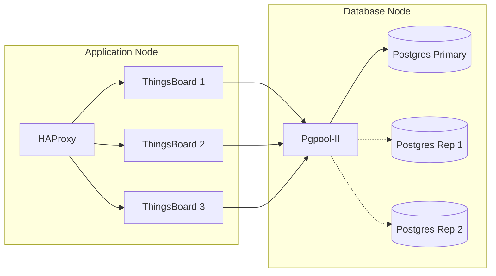

# ThingsBoard - Multiple Operation (Distributed)

This branch contains the deployment configuration for a distributed ThingsBoard architecture.
*   **Node 1**: Runs 3 replicas of ThingsBoard Node (Monolith) and an HAProxy Load Balancer.
*   **Node 2**: Runs a PostgreSQL Cluster (Primary + 2 Replicas) managed by Pgpool-II.

## 🏗️ Architecture



## 🚀 Deployment Guide

### Step 1: Database Layer (Node 2)

1.  Navigate to the `db` folder:
    ```bash
    cd db
    ```
2.  Start the Database Cluster:
    ```bash
    docker compose up -d
    ```
3.  **Verify**: Ensure Pgpool is listening on port `8080` (mapped from container 9999).

### Step 2: Application Layer (Node 1)

1.  Navigate to the `server` folder:
    ```bash
    cd server
    ```
2.  **Create External Network**:
    ```bash
    docker network create tb-network
    ```
3.  **Configure Connection**:
    Edit `.env` to match your setup (specifically `PG_HOST`).
    
    **`.env` defaults:**
    ```ini
    TB1_PORT=8082
    TB2_PORT=8083
    TB3_PORT=8084
    PG_HOST=192.168.2.105
    PG_PORT=8080
    ```

4.  **First Run (Installation)**:
    *For the very first deployment, you must initialize the database.*
    
    1.  Open `docker-compose.yml`.
    2.  Uncomment the following lines for **one** service (e.g., `thingsboard-1`):
        ```yaml
        environment:
          - INSTALL_TB=true
          - LOAD_DEMO=true
        ```
    3.  Start the services:
        ```bash
        docker compose up -d
        ```
    4.  Monitor logs: `docker compose logs -f thingsboard-1`.
    5.  Once installation finishes (or container restarts), **stop the services**:
        ```bash
        docker compose down
        ```
    6.  **Comment out** `INSTALL_TB` and `LOAD_DEMO` in `docker-compose.yml` to prevent re-installation attempts.
    7.  Start again for normal operation:
        ```bash
        docker compose up -d
        ```

### Step 3: Load Balancer (Node 1)

1.  Navigate to the `nginx` folder (contains HAProxy):
    ```bash
    cd nginx
    ```
2.  Start the Load Balancer:
    ```bash
    docker compose up -d
    ```

## 🔍 Services & Ports

| Service | Port | Description |
|---------|------|-------------|
| **Load Balancer** | `8081` | Unified Web UI/API Access |
| **ThingsBoard 1** | `8082` | Direct Instance Access |
| **ThingsBoard 2** | `8083` | Direct Instance Access |
| **ThingsBoard 3** | `8084` | Direct Instance Access |
| **PgPool (DB)** | `8080` | Database Entry Point (Node 2) |

## 🛑 Shutdown

To stop the application layer:
```bash
cd server
docker compose down
cd nginx
docker compose down
```

To stop the database layer:
```bash
cd db
docker compose down -v
```
