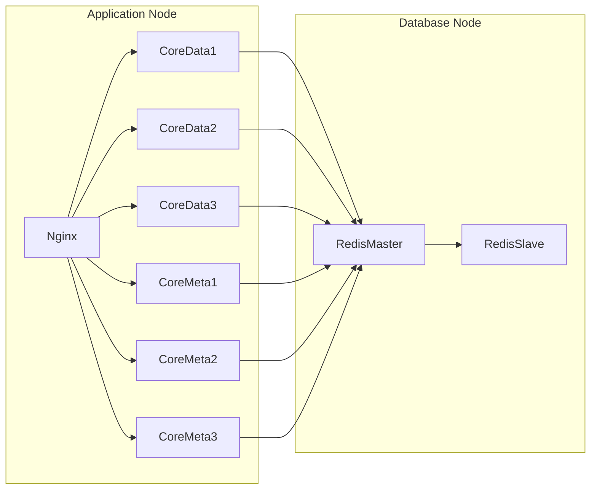

# EdgeX Foundry - Multiple Operation (Distributed)

This branch contains the deployment configuration for a distributed EdgeX architecture.
*   **Node 1**: Runs 3 replicas of Core Data and Core Metadata, plus other singleton services and an Nginx LB.
*   **Node 2**: Runs a Redis Master-Slave cluster.

## 🏗️ Architecture



## 🚀 Deployment Guide

### Step 1: Database Layer (Node 2)

1.  Navigate to the `db` folder:
    ```bash
    cd db
    ```
2.  Start the Redis cluster:
    ```bash
    docker compose up -d
    ```
3.  **Important**: Ensure the Redis Master port `6379` is accessible from Node 1.

### Step 2: Application Layer (Node 1)

1.  Navigate to the `server` folder:
    ```bash
    cd server
    ```
2.  **Create the External Network**:
    ```bash
    docker network create edgex-network
    ```
3.  **Configure Connection**:
    Edit the `.env` file in `server/` to point to your **Node 2 IP address**.
    
    **`.env` example:**
    ```ini
    DB_HOST=192.168.2.105
    ```
    
    *If you need to change this IP, simply edit the file before starting.*

4.  Start the services:
    ```bash
    docker compose up -d
    ```

### Step 3: Verification

1.  Wait for services to initialize (approx 30s).
2.  Run the health check script:
    ```bash
    ../check_health.sh
    ```

## 🔍 Services & Ports

| Service | Port | Description |
|---------|------|-------------|
| **Nginx LB** | `8080` | Main API Gateway |
| **EdgeX UI** | `4000` | Management Console |
| **Core Data (LB)** | `59880` | Load Balanced via Nginx |
| **Core Metadata (LB)** | `59881` | Load Balanced via Nginx |
| **Core Command** | `59882` | Command Service |
| **Device Virtual** | `59900` | Device Simulator |

## 🛑 Shutdown

To stop the application layer:
```bash
cd server
docker compose down
```

To stop the database layer:
```bash
cd db
docker compose down -v
```