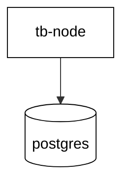
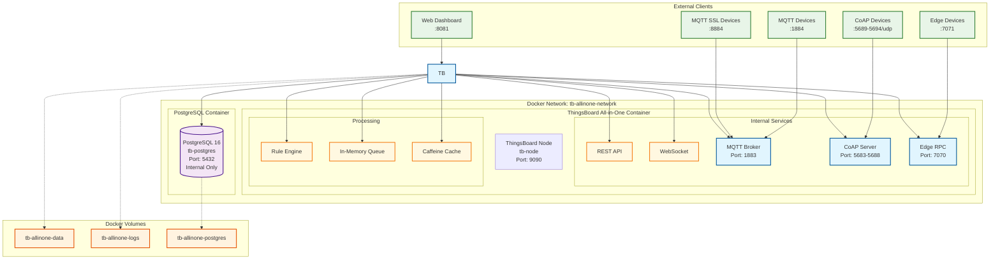
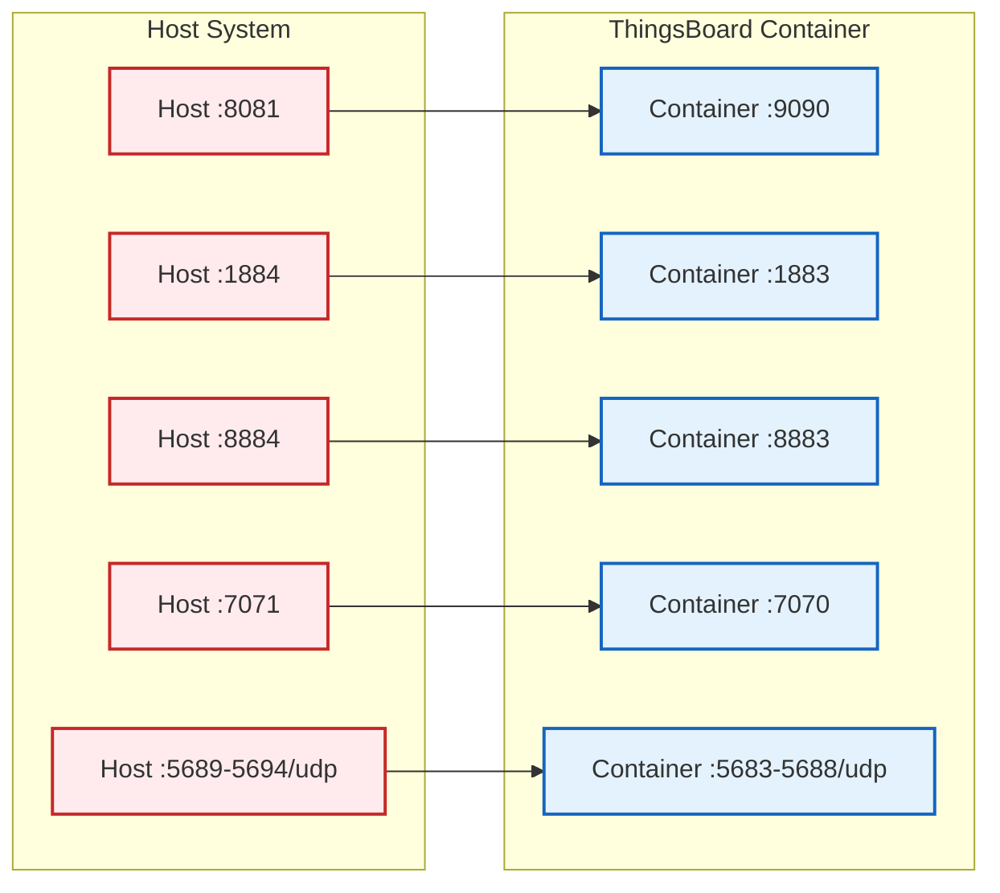
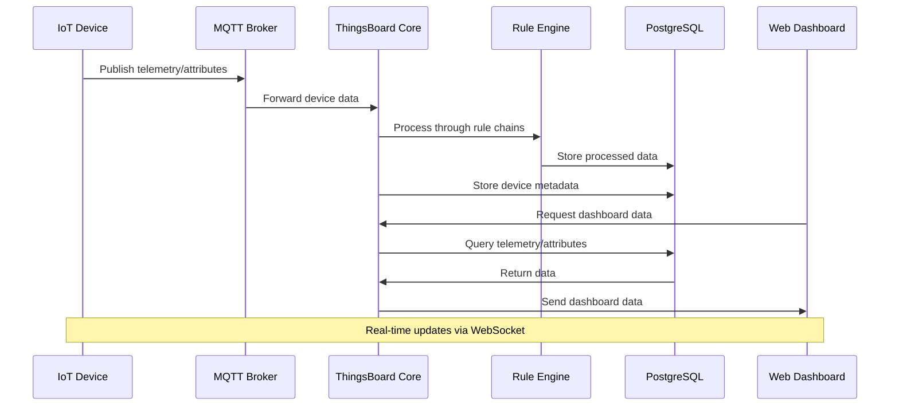

# ThingsBoard IoT Platform Architecture

This document contains Mermaid diagrams illustrating the ThingsBoard all-in-one platform setup.

## System Architecture Overview



## Original Complex Architecture



## Port Mapping Details



## Data Flow Diagram



## Service Dependencies

```mermaid
graph TD
    START([Docker Compose Up])
    
    START --> PG_START[Start PostgreSQL Container]
    PG_START --> PG_HEALTH{PostgreSQL<br/>Health Check}
    PG_HEALTH -->|Pass| TB_START[Start ThingsBoard Container]
    PG_HEALTH -->|Fail| PG_RETRY[Wait & Retry]
    PG_RETRY --> PG_HEALTH
    
    TB_START --> TB_INIT[Initialize ThingsBoard]
    TB_INIT --> TB_HEALTH{ThingsBoard<br/>Health Check}
    TB_HEALTH -->|Pass| READY[System Ready]
    TB_HEALTH -->|Fail| TB_RETRY[Wait & Retry]
    TB_RETRY --> TB_HEALTH
    
    READY --> ACCESS[Access via :8081]

    classDef start fill:#c8e6c9,stroke:#388e3c,stroke-width:2px
    classDef process fill:#fff3e0,stroke:#f57c00,stroke-width:2px
    classDef decision fill:#f3e5f5,stroke:#7b1fa2,stroke-width:2px
    classDef end fill:#ffcdd2,stroke:#d32f2f,stroke-width:2px

    class START,READY,ACCESS start
    class PG_START,TB_START,TB_INIT,PG_RETRY,TB_RETRY process
    class PG_HEALTH,TB_HEALTH decision
```

## Configuration Overview

| Component | Configuration | Value |
|-----------|---------------|-------|
| **ThingsBoard** | Service Type | Monolith (All-in-One) |
| | Queue Type | In-Memory |
| | Cache Type | Caffeine |
| | Memory | 768MB-1536MB |
| **PostgreSQL** | Version | 16 |
| | Database | thingsboard |
| | User/Password | postgres/postgres |
| | Access | Internal only |
| **Network** | Driver | Bridge |
| | Name | tb-allinone-network |
| **Volumes** | Data | tb-allinone-data |
| | Logs | tb-allinone-logs |
| | Database | tb-allinone-postgres |

## Access URLs

- **Web Dashboard**: http://localhost:8081
- **MQTT Endpoint**: localhost:1884
- **MQTT SSL Endpoint**: localhost:8884  
- **CoAP Endpoint**: localhost:5689-5694/udp
- **Edge RPC**: localhost:7071

## Health Checks

- **PostgreSQL**: `pg_isready -U postgres` (every 30s)
- **ThingsBoard**: `curl -f http://localhost:9090/login` (every 45s, 7min startup grace period)